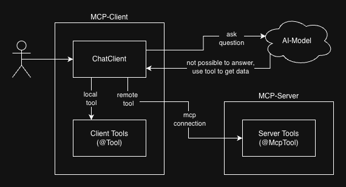

# Based on

- Dan Vega: https://github.com/danvega/dvaas-client/tree/master
- Josh Long: https://github.com/joshlong-attic/2026-02-18-bootiful-dogumentary/tree/main/assistant
- Examples: https://github.com/spring-projects/spring-ai-examples/tree/main/model-context-protocol

# Important Setup Steps

- openai
  - spring-ai-starter-model-openai dependency in pom.xml
  - spring.ai.openai.api-key EnvVar in application.yml
- client
  - spring-ai-starter-mcp-client dependency in pom.xml
  - spring.ai.mcp.client config in application.yml
  - https://docs.spring.io/spring-ai/reference/api/mcp/mcp-client-boot-starter-docs.html

# Testing:

- first start the server, then the client (otherwise client-start will fail because it can't connect to the server)
- client tools (local function calling)
  - enter http://localhost:8080/chat/docs in the browser to trigger ai-chat with local tools of client
- server tools (mcp-server calling)
  - enter http://localhost:8080/chat/repos in the browser to trigger ai-chat with server tools via mcp

# Tool Calling Architecture:

- https://docs.spring.io/spring-ai/reference/concepts.html#concept-fc

